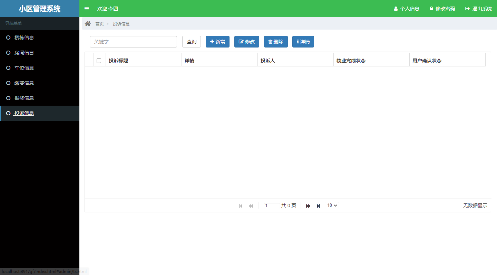

这是一个基于ssm的小区物业管理系统

项目代码已收录公众号【java项目源码】，需要请自行关注一下公众号并下载源码

涉及技术：spring+springmvc+mybatis+html+bootstrap+shiro等
主要系统分为二种角色管理员和住户：

管理员功能：业主管理，楼栋信息，房间信息，房号绑定，车位信息，缴费信息，保修信息，投诉信息，修改密码

住户功能：楼栋信息，房间信息，车位信息，缴费信息，保修信息，投诉信息，修改密码

账号密码加密，admin 123123   所有默认密码都为123123

CSDN博客地址：[ssm的小区物业管理系统](https://blog.csdn.net/mataodehtml/article/details/116517122)

运行视频地址：[ssm的小区物业管理系统](https://www.bilibili.com/video/BV1d5411g7wE)

运行截图：
业主：

管理员：

